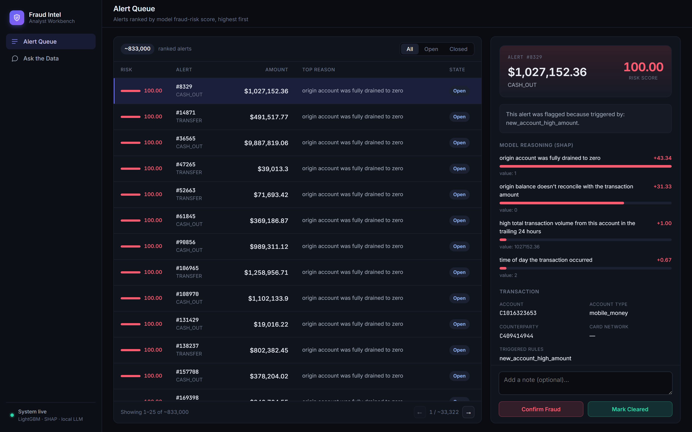
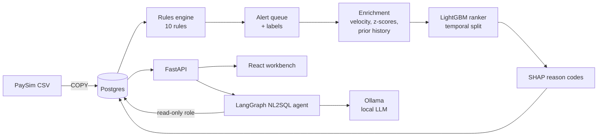
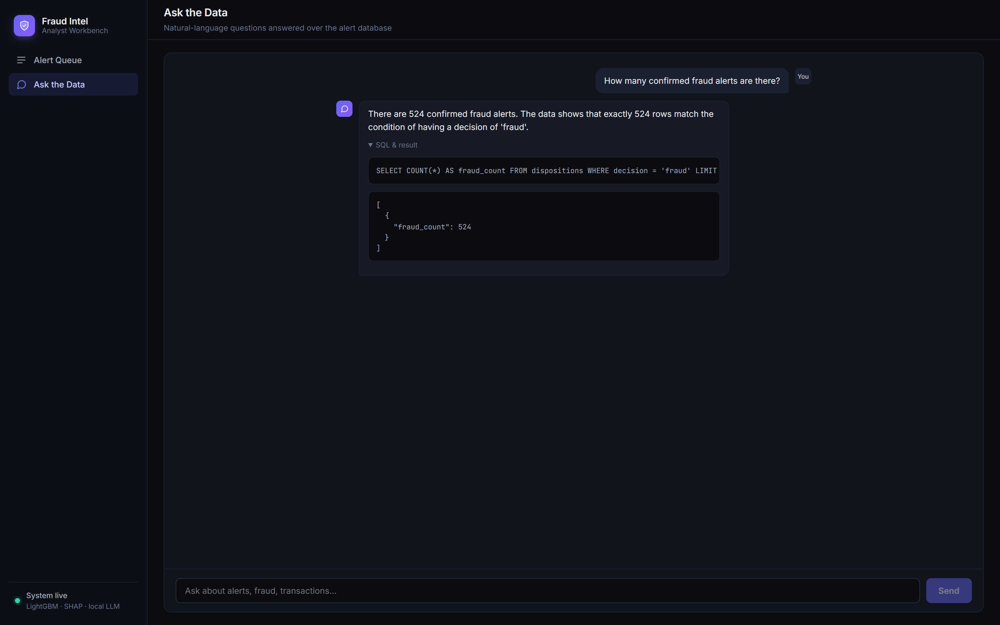

# Fraud Analyst Workbench

[](https://github.com/kckarthik/fraud-analyst-workbench/actions/workflows/ci.yml)

An end-to-end fraud investigation platform: a rules engine that generates a
realistically noisy alert queue, a LightGBM model that ranks it by risk, SHAP
reason codes that explain every score in plain language, and a React workbench
where an analyst works the queue and asks questions in natural language against
a locally-hosted LLM.

**The first 100 alerts of the ranked queue hold 68 of the 69 confirmed frauds
in a 197,715-alert test set — 68% of that first screenful is fraud. Worked by
transaction amount instead, which is what a team without a model does, the same
100 alerts catch 14.**



*Alerts ranked by model score, with SHAP reason codes translated into plain
language and the disposition workflow inline.*

---

## The problem it models

Bank fraud teams don't suffer from a shortage of alerts — they suffer from too
many. Industry false-positive rates run 80–95%, so analysts spend the day
clearing noise while real fraud sits unreviewed in the same undifferentiated
queue.

This platform doesn't replace the rules. It reorders their output, so fraud
surfaces at the top of the queue instead of somewhere in the middle of 988,000
alerts.

---

## Architecture



Scores and reason codes are written back into Postgres as JSONB, so serving the
ranked queue is a single indexed query — no inference at request time.

---

## Results

Trained on a 1M-transaction sample producing **988,573 alerts**, of which 523
are confirmed fraud (0.05%). Split chronologically — train on 790,858 earlier
alerts, test on 197,715 later ones. Not a random split: a random split leaks
future account behaviour into training and flatters the result. This is how a
real deployment validates — score tomorrow with a model trained through
yesterday.

| Metric | Value |
|---|---|
| ROC-AUC | 0.9985 |
| PR-AUC | 0.9856 |

**Queue-depth performance.** Cutoffs are absolute, not percentages, because a
team works a fixed number of alerts per shift — not a fixed fraction of a queue
whose size they don't control. The last column is the same queue sorted by
transaction amount descending: the ordering a team without a model actually
uses, and a fairer comparator than random order.

| Alerts reviewed | Fraud caught | Precision | Sorted by amount instead |
|---|---|---|---|
| **Top 100** | **68 / 69** | **68.0%** | 14 / 69 |
| Top 250 | 68 / 69 | 27.2% | 14 / 69 |
| Top 500 | 68 / 69 | 13.6% | 18 / 69 |
| Top 1,000 | 68 / 69 | 6.8% | 22 / 69 |

The whole result sits in the first hundred alerts. Everything catchable is
already caught there, so the deeper rows only dilute precision — reviewing
1,000 instead of 100 costs 10× the effort and finds nothing further.

Two things this table does not say:

- **The 69th fraud is genuinely hard.** It is still missing at 19,772 alerts
  and only appears by 39,543 — the model ranks it no better than an arbitrary
  alert. Recall does reach 100%, but at 39,543 alerts of review for that one
  case, which is a decision about appetite rather than a modelling win.
- **69 positives is a small denominator.** "98.6%" implies precision the sample
  can't support: the 95% Wilson interval on 68/69 runs from **92.2% to 99.7%**,
  and one more miss moves the point estimate by 1.4 points. The reports carry
  that interval, and `train.py` warns when a test split has fewer than 100
  confirmed-fraud alerts. Read the counts, not the decimals.

For reference, the same run by percentage depth — 5% is 9,886 alerts for
exactly the same 68 catches, which is why this framing was abandoned:

| Review depth | Alerts reviewed | Fraud caught | Precision |
|---|---|---|---|
| Top 5% | 9,886 | 68 / 69 | 0.7% |
| Top 10% | 19,772 | 68 / 69 | 0.3% |
| Top 20% | 39,543 | 69 / 69 | 0.2% |

Every score carries SHAP reason codes rendered in plain language — *"origin
account was fully drained to zero,"* *"origin balance doesn't reconcile with
the transaction amount"* — so an analyst sees why an alert ranked where it did,
and the ranking is auditable rather than a black box.

---

## Engineering notes

The parts that were actually hard, and what came out of them.

### A silent feature-misalignment bug

Velocity features were computed with a `groupby().rolling()` whose output was
assigned back positionally. But `groupby` returns rows in
`(account_id, timestamp)` order while the frame was sorted by timestamp alone —
so **every velocity value landed on the wrong transaction**. No error, no
warning, plausible-looking numbers.

Caught by building a small keyed synthetic frame where the correct answer was
known in advance and asserting per-row rather than eyeballing aggregates.
Fixing it moved ROC-AUC from **0.69 → 0.84**.

### Feature engineering beat model tuning

The remaining gap closed with domain features, not hyperparameters — balance
reconciliation in particular:

```python
error_balance_orig = orig_balance_before - amount - orig_balance_after
orig_emptied       = (orig_balance_before > 0) & (orig_balance_after == 0)
```

An account drained to exactly zero is the signature of this fraud typology.
Adding these took AUC **0.84 → 0.998** — the model was never the bottleneck.

### Ranking is not classification

An early model scored fraud 0.76 vs non-fraud 0.44 on average — respectable —
yet only **1 of the top 1,000 alerts** was fraud. `scale_pos_weight` had been
set to the full negative/positive ratio (~2,176:1), saturating 437,002 alerts
at ≥0.999. Correct for a classifier, useless for a ranker, because everything
tied at the top and the ordering within that tie was arbitrary.

```python
# Mild imbalance correction, NOT the full n_neg/n_pos ratio
scale_pos_weight = min(np.sqrt(n_neg / n_pos), 25.0)
```

Fraud in the top 1,000 went from **1 → 522** of 523.

### Performance

| Stage | Before | After | How |
|---|---|---|---|
| Rules engine | 114s | 9.3s | Vectorized expanding stats via cumsum; dropped FKs during bulk load |
| Enrichment | 120s | 9.5s | Replaced `groupby.transform(lambda)` with cumsum math |
| JSONB write-back | 49s | 5.3s | `COPY` to temp table + one `UPDATE...FROM` join |
| Ranked queue query | 80s | 2.7ms | See below |

The API fix is the one worth reading. A functional index on the JSONB score
expression was ignored by the planner once a join and parallel workers were
involved, falling back to a 428MB external disk sort. Materializing
`model_score` as a real column helped — but the true root cause was Docker's
**64MB default `/dev/shm`**, which surfaced as `could not resize shared memory
segment` on a plain `VACUUM`. One line in `docker-compose.yml`:

```yaml
shm_size: "1gb"
```

The ranked query itself is now 2.7ms. That left the endpoint dominated by
something far dumber: an exact `COUNT(*)` over all 988,573 alerts, run on every
request to render "of N" in the pagination footer — an unindexed scan costing
more than everything else combined. It now asks the planner for its row
estimate instead (`EXPLAIN (FORMAT JSON)`, which respects the same filters),
and falls back to an exact count only when the estimate is small enough that
counting is cheap. So filtered views stay precise, the full-queue total is
approximate, and the response marks which one it returned so the UI can render
`~986,673` rather than presenting an estimate as fact.

That change has a dependency worth stating, because it fails silently: the
planner's estimate is only as good as its statistics. `explain.py` rewrites
`model_score` on all 988,573 rows, and until the table is re-sampled the
planner still believes the column is entirely NULL — so it estimates ~0 rows
for the queue's `model_score IS NOT NULL` predicate and the endpoint quietly
falls back to the exact count, at exactly the moment the table is largest.
Nothing breaks; it just gets slow again. `explain.py` therefore runs `ANALYZE`
as its final step rather than waiting for autovacuum.

---

## Tests

```bash
pip install -r requirements-dev.txt
pytest
```

59 tests, no database required — the suite is pure DataFrame and SQL-parsing
logic, so CI runs it without a Postgres service container. Three areas get
disproportionate coverage because that's where the risk is:

**The SQL guard.** An LLM writes SQL and we execute it, so the guard is tested
in isolation, assuming the read-only role does not exist. Coverage includes
statement stacking, stacking hidden behind a comment (which defeats a
regex-based guard), and every route to the hidden `transactions` table —
direct, CTE, subquery, join, and `UNION` — because that table holds the
ground-truth label.

**Feature alignment.** The velocity tests are a regression suite for a real
bug where features landed on the wrong rows. Two properties make them able to
catch it: assertions are keyed by `transaction_id` rather than positional, and
the fixture interleaves two accounts in time so global-timestamp order and
`(account_id, ts)` order genuinely differ. Positional assertions on contiguous
data would have passed against the broken implementation.

**Queue-depth reporting.** The numbers in the Results section are read straight
off this code, and its failure mode isn't a crash — it's a plausible number
that overstates the result. So the tests pin the off-by-one at the cutoff (does
"top K" include the Kth alert?), tie-breaking (thousands of alerts here score
≥0.999, so an unstable sort would make the report vary between runs), and the
guard against emitting a duplicate full-queue row for every K past the end,
which would render as a run of 100% rows implying deeper review kept helping.

Writing these surfaced a live finding: `amount_zscore` evaluates to 0.0 for
100% of alerts in the loaded dataset, because PaySim's accounts are nearly all
singletons and a standard deviation needs two prior points. The feature is
structurally dead here. It's pinned by a test documenting the behaviour rather
than quietly patched, since changing it alters feature semantics and requires
retraining.

---

## Security design

The natural-language agent lets an LLM generate SQL against a live database —
an obvious injection surface. Two independent layers, either of which holds
alone:

**1. Least-privilege database role.** The agent connects as
`fraud_intel_readonly`, which holds `SELECT` only and reads through a view that
excludes `is_fraud` — the ground-truth label. Even a perfect prompt injection
cannot write, and cannot read the answer key.

```sql
GRANT SELECT ON accounts, alerts, dispositions, rules, analyst_transactions
  TO fraud_intel_readonly;
REVOKE ALL ON transactions FROM fraud_intel_readonly;
```

**2. AST-based SQL guard.** Generated SQL is parsed with `sqlglot` and rejected
unless it is a single `SELECT` over allow-listed tables, with dangerous
functions blocked and a `LIMIT` forced to ≤200. Parsed rather than
regex-matched, because regexes on SQL lose to comment tricks and stacked
statements.

Credentials load from a gitignored `.env` and fail loudly when absent — no
fallback passwords in source.



*The agent generates SQL, validates it, executes it as a read-only role, and
summarizes the result — with the generated query shown so the analyst can
check it rather than trust it.*

---

## Stack

| Layer | Technology |
|---|---|
| Data & ML | Postgres 16, pandas, LightGBM, SHAP |
| Backend | FastAPI, SQLAlchemy, LangGraph, sqlglot |
| Frontend | React 19, TypeScript, Vite |
| LLM | Ollama — local inference, no data leaves the machine |

---

## Running it

```bash
python -m venv venv
source venv/bin/activate          # Windows: venv\Scripts\activate
pip install -r requirements.txt

cp .env.example .env              # then fill in local values
docker compose up -d
```

Create the schema — the read-only role's password is supplied at run time
rather than hardcoded:

```bash
docker exec -i fraud-intel-db psql -U postgres -d fraud_intel \
  -v readonly_password="$DB_READONLY_PASSWORD" < db/schema.sql
```

Download [PaySim](https://www.kaggle.com/datasets/ealaxi/paysim1) into `data/`,
then build the pipeline:

```bash
cd db            && python load_data_paysim.py --sample 1000000
cd ../rules      && python engine.py --skip-rules new_device,missing_identity_high_amount,region_mismatch
cd ../enrichment && python pipeline.py
cd ../model      && python train.py && python explain.py
```

Serve it:

```bash
ollama pull llama3.2:3b
cd backend  && uvicorn main:app --reload    # :8000
cd frontend && npm install && npm run dev   # :5173
```

`--sample 1000000` is a deliberate ceiling tuned for an 8GB machine; the full
6.3M rows need roughly 32GB for the rules engine's sort.

---

## Scope

Built on [PaySim](https://www.kaggle.com/datasets/ealaxi/paysim1), a public
synthetic dataset, to reproduce the *structure* of a bank fraud pipeline
end-to-end. Two things worth knowing when reading the metrics:

- **The 0.998 AUC is a property of the dataset as much as the model.** PaySim's
  fraud typology drains the origin account to zero, which balance
  reconciliation captures almost perfectly. The transferable result here is the
  method — the 0.69 → 0.84 → 0.998 progression through a correctness fix and
  domain feature engineering — not the headline number.
- **Labels are the dataset's ground truth**, backfilled as analyst
  dispositions, so the disposition workflow is modelled end-to-end without
  waiting on real review history. Those seeded rows are written under
  `analyst_id = 'seed_ground_truth'` and the API filters them out of everything
  it serves: they are the training label, but surfacing them in the workbench
  would show an analyst the answer before they investigated, and would mark
  every untouched alert as already decided. The model reads them; the analyst
  never does.

`device_id`, `ip_proxy`, and `region_code` have no PaySim equivalent, so three
of the ten rules are skipped under this dataset and fire under IEEE-CIS
(`db/load_data.py`) instead.
